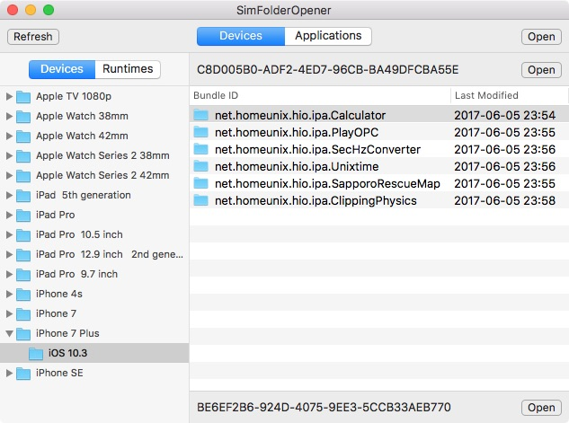
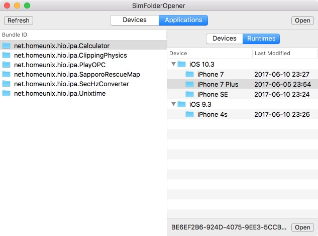

# SimFolderOpener

This application will help you to open application document folder in the iOS Simulator.

## Usage

### Open a device folder

1. Select ``Devices`` segment from upper panel.
2. Select a device from left tree.
3. Click ``Open`` button in upper panel or double click the selected node.

### Open an application document folder

1. Select ``Devices`` segment from upper panel.
2. Select a device from left tree.
3. Select a application from right table.
4. Click ``Open`` button in lower panel or double click the selected row.

## Requirements

* macOS 10.13.4
* Xcode 9.3.1

## License

Please read [this file](LICENSE).

